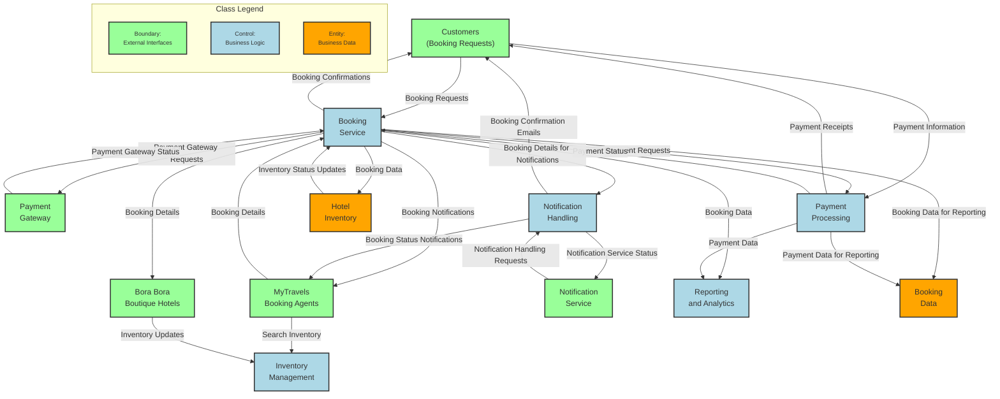
```mermaid
graph TD
    %% External Entities (Boundary Classes)
    customers["Customers<br>(Booking Requests)"]:::boundary
    agents["MyTravels<br>Booking Agents"]:::boundary
    hotels["Bora Bora<br>Boutique Hotels"]:::boundary
    payment_gateway["Payment<br>Gateway"]:::boundary
    notification_service["Notification<br>Service"]:::boundary

    %% Processes (Control Classes)
    inventory_management["Inventory<br>Management"]:::control
    booking_service["Booking<br>Service"]:::control
    payment_processing["Payment<br>Processing"]:::control
    notification_handling["Notification<br>Handling"]:::control
    reporting_analytics["Reporting<br>and Analytics"]:::control

    %% Entity Classes
    hotel_inventory["Hotel<br>Inventory"]:::entity
    booking_data["Booking<br>Data"]:::entity

    %% Data Flows
    customers -->|"Booking Requests"| booking_service
    customers -->|"Payment Information"| payment_processing
    booking_service -->|"Booking Confirmations"| customers
    payment_processing -->|"Payment Receipts"| customers

    agents -->|"Search Inventory"| inventory_management
    agents -->|"Booking Details"| booking_service
    booking_service -->|"Booking Notifications"| agents

    hotels -->|"Inventory Updates"| inventory_management
    booking_service -->|"Booking Details"| hotels
    booking_service -->|"Booking Data"| hotel_inventory
    hotel_inventory -->|"Inventory Status Updates"| booking_service

    booking_service -->|"Payment Requests"| payment_processing
    payment_processing -->|"Payment Status"| booking_service

    booking_service -->|"Booking Details for Notifications"| notification_handling
    notification_handling -->|"Booking Confirmation Emails"| customers
    notification_handling -->|"Booking Status Notifications"| agents

    booking_service -->|"Booking Data"| reporting_analytics
    payment_processing -->|"Payment Data"| reporting_analytics

    %% New connections for unconnected elements
    booking_service -->|"Payment Gateway Requests"| payment_gateway
    payment_gateway -->|"Payment Gateway Status"| booking_service

    notification_service -->|"Notification Handling Requests"| notification_handling
    notification_handling -->|"Notification Service Status"| notification_service

    booking_service -->|"Booking Data for Reporting"| booking_data
    payment_processing -->|"Payment Data for Reporting"| booking_data

    %% Styling for each class type
    classDef boundary fill:#99FF99,stroke:#333,stroke-width:2px;
    classDef control fill:#ADD8E6,stroke:#333,stroke-width:2px;
    classDef entity fill:#FFA500,stroke:#333,stroke-width:2px;

    class customers,agents,hotels,payment_gateway,notification_service boundary;
    class inventory_management,booking_service,payment_processing,notification_handling,reporting_analytics control;
    class hotel_inventory,booking_data entity;

    %% Legend/Key (indicating class types and their colors)
    subgraph Legend["Class Legend"]
        direction TB
        boundary_legend["Boundary:<br>External Interfaces"]:::boundary
        control_legend["Control:<br>Business Logic"]:::control
        entity_legend["Entity:<br>Business Data"]:::entity
    end

    %% Styling for the legend
    class boundary_legend,control_legend,entity_legend legend_style;
    classDef legend_style fill:#f8f8f8,stroke:#333,stroke-width:1px, font-size:12px;

    %% Connecting Legend Items to Show the Color
    class boundary_legend boundary;
    class control_legend control;
    class entity_legend entity;

```

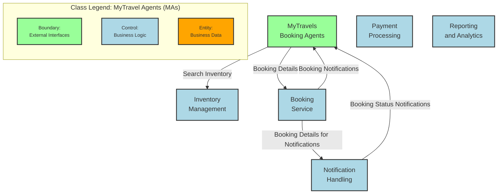
```mermaid
graph TD
    %% Legend/Key (indicating class types and their colors)
    subgraph Legend["Class Legend: MyTravel Agents (MAs)"]
        direction TB
        boundary_legend["Boundary:<br>External Interfaces"]:::boundary
        control_legend["Control:<br>Business Logic"]:::control
        entity_legend["Entity:<br>Business Data"]:::entity
    end

    %% Styling for the legend
    class boundary_legend,control_legend,entity_legend legend_style;
    classDef legend_style fill:#f8f8f8,stroke:#333,stroke-width:1px, font-size:12px;

    %% Connecting Legend Items to Show the Color
    class boundary_legend boundary;
    class control_legend control;
    class entity_legend entity;


    classDef boundary fill:#99FF99,stroke:#333,stroke-width:2px;
    classDef control fill:#ADD8E6,stroke:#333,stroke-width:2px;
    classDef entity fill:#FFA500,stroke:#333,stroke-width:2px;

    %% External Entities (Boundary Classes)
    agents["MyTravels<br>Booking Agents"]:::boundary

    %% Processes (Control Classes)
    inventory_management["Inventory<br>Management"]:::control
    booking_service["Booking<br>Service"]:::control
    notification_handling["Notification<br>Handling"]:::control
    payment_processing["Payment<br>Processing"]:::control
    reporting_analytics["Reporting<br>and Analytics"]:::control

    %% Data Flows
    agents -->|"Search Inventory"| inventory_management
    agents -->|"Booking Details"| booking_service
    booking_service -->|"Booking Notifications"| agents

    booking_service -->|"Booking Details for Notifications"| notification_handling
    notification_handling -->|"Booking Status Notifications"| agents

    class agents boundary;
    class inventory_management,booking_service,notification_handling,payment_processing,reporting_analytics control;
```
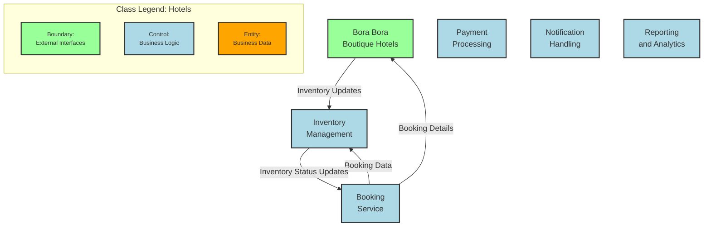
```mermaid
graph TD
    %% Legend/Key (indicating class types and their colors)
    subgraph Legend["Class Legend: Hotels"]
        direction TB
        boundary_legend["Boundary:<br>External Interfaces"]:::boundary
        control_legend["Control:<br>Business Logic"]:::control
        entity_legend["Entity:<br>Business Data"]:::entity
    end

    %% Styling for the legend
    class boundary_legend,control_legend,entity_legend legend_style;
    classDef legend_style fill:#f8f8f8,stroke:#333,stroke-width:1px, font-size:12px;

    %% Connecting Legend Items to Show the Color
    class boundary_legend boundary;
    class control_legend control;
    class entity_legend entity;
    %% External Entities (Boundary Classes)
    hotels["Bora Bora<br>Boutique Hotels"]:::boundary

    %% Processes (Control Classes)
    inventory_management["Inventory<br>Management"]:::control
    booking_service["Booking<br>Service"]:::control
    payment_processing["Payment<br>Processing"]:::control
    notification_handling["Notification<br>Handling"]:::control
    reporting_analytics["Reporting<br>and Analytics"]:::control

    %% Data Flows
    hotels -->|"Inventory Updates"| inventory_management
    booking_service -->|"Booking Details"| hotels
    booking_service -->|"Booking Data"| inventory_management
    inventory_management -->|"Inventory Status Updates"| booking_service

    %% Styling for each class type
    classDef boundary fill:#99FF99,stroke:#333,stroke-width:2px;
    classDef control fill:#ADD8E6,stroke:#333,stroke-width:2px;
    classDef entity fill:#FFA500,stroke:#333,stroke-width:2px;

    class hotels boundary;
    class inventory_management,booking_service,payment_processing,notification_handling,reporting_analytics control;

```

```mermaid
graph TD
    %% External Entities
    HM["Hotel Manager"]:::external
    MA["MyTravel Agent"]:::external
    C["Customer"]:::external
    U["User"]:::external

    %% System Components
    S["System"]:::system
    NS["Notification Service"]:::system
    PG["Payment Gateway"]:::system

    %% Databases
    DB["Inventory Database"]:::database
    BD["Booking Database"]:::database
    CPD["Customer Profile Database"]:::database

    %% FR1: Manage Inventory
    HM -->|Inputs room availability, details| S
    S -->|Updates inventory| DB
    S -->|Confirmation or error handling| HM

    %% FR2: Search Inventory
    MA -->|Inputs search criteria| S
    S -->|Queries inventory| DB
    DB -->|Search results| S
    S -->|Filters results or notifies of no results| MA

    %% FR3: Book Room
    MA -->|Inputs booking criteria| S
    S -->|Checks availability| DB
    DB -->|Available rooms| S
    MA -->|Confirms booking| S
    S -->|Processes booking| BD
    S -->|Sends booking confirmation or error| MA

    %% FR4: Process Payment
    C -->|Provides payment details| S
    S -->|Sends payment for verification| PG
    PG -->|Payment status| S
    S -->|Updates booking payment status| BD
    S -->|Sends confirmation or failure message| C

    %% FR5: Send Notification
    S -->|Generates notification| NS
    NS -->|Sends notification| U
    S -->|Retries or notifies of failure| U

    %% FR6: Manage Customer Profile
    MA -->|Accesses customer profile| S
    S -->|Displays profile details| MA
    MA -->|Updates profile information| S
    S -->|Saves updates| CPD
    S -->|Notifies agent of issue| MA

    %% Class Definitions
    classDef external fill:#99FF99,stroke:#333,stroke-width:2px;
    classDef system fill:#ADD8E6,stroke:#333,stroke-width:2px;
    classDef database fill:#FFA500,stroke:#333,stroke-width:2px;

    %% Class Assignments
    class HM,MA,C,U external;
    class S,NS,PG system;
    class DB,BD,CPD database;

```

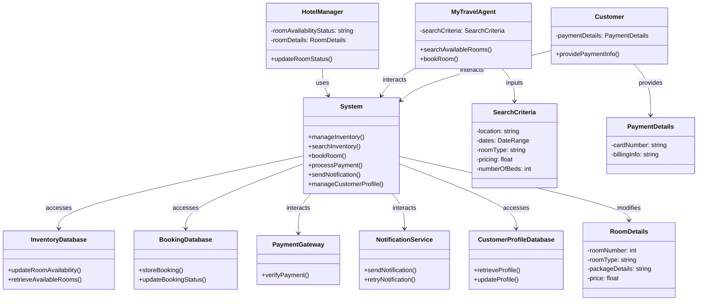
```mermaid
classDiagram
    class HotelManager {
        -roomAvailabilityStatus: string
        -roomDetails: RoomDetails
        +updateRoomStatus()
    }

    class RoomDetails {
        -roomNumber: int
        -roomType: string
        -packageDetails: string
        -price: float
    }

    class System {
        +manageInventory()
        +searchInventory()
        +bookRoom()
        +processPayment()
        +sendNotification()
        +manageCustomerProfile()
    }

    class InventoryDatabase {
        +updateRoomAvailability()
        +retrieveAvailableRooms()
    }

    class BookingDatabase {
        +storeBooking()
        +updateBookingStatus()
    }

    class PaymentGateway {
        +verifyPayment()
    }

    class NotificationService {
        +sendNotification()
        +retryNotification()
    }

    class MyTravelAgent {
        -searchCriteria: SearchCriteria
        +searchAvailableRooms()
        +bookRoom()
    }

    class SearchCriteria {
        -location: string
        -dates: DateRange
        -roomType: string
        -pricing: float
        -numberOfBeds: int
    }

    class Customer {
        -paymentDetails: PaymentDetails
        +providePaymentInfo()
    }

    class PaymentDetails {
        -cardNumber: string
        -billingInfo: string
    }

    class CustomerProfileDatabase {
        +retrieveProfile()
        +updateProfile()
    }

    %% Associations
    HotelManager --> System : uses
    MyTravelAgent --> System : interacts
    System --> InventoryDatabase : accesses
    System --> BookingDatabase : accesses
    System --> PaymentGateway : interacts
    System --> NotificationService : interacts
    System --> CustomerProfileDatabase : accesses
    Customer --> System : interacts
    System --> RoomDetails : modifies
    MyTravelAgent --> SearchCriteria : inputs
    Customer --> PaymentDetails : provides

```

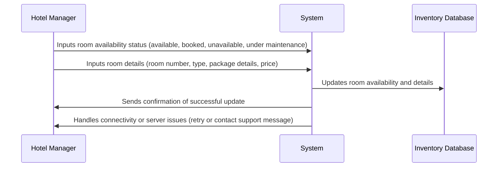
```mermaid
sequenceDiagram
    participant HM as Hotel Manager
    participant S as System
    participant DB as Inventory Database

    HM->>S: Inputs room availability status (available, booked, unavailable, under maintenance)
    HM->>S: Inputs room details (room number, type, package details, price)
    S->>DB: Updates room availability and details
    S->>HM: Sends confirmation of successful update
    S->>HM: Handles connectivity or server issues (retry or contact support message)
```

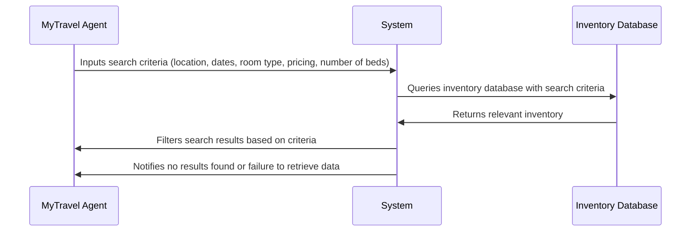
```mermaid
sequenceDiagram
    participant MA as MyTravel Agent
    participant S as System
    participant DB as Inventory Database

    MA->>S: Inputs search criteria (location, dates, room type, pricing, number of beds)
    S->>DB: Queries inventory database with search criteria
    DB->>S: Returns relevant inventory
    S->>MA: Filters search results based on criteria
    S->>MA: Notifies no results found or failure to retrieve data

```

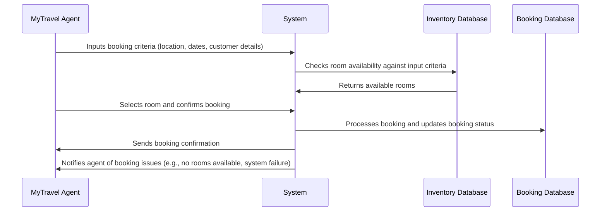
```mermaid
sequenceDiagram
    participant MA as MyTravel Agent
    participant S as System
    participant DB as Inventory Database
    participant BD as Booking Database

    MA->>S: Inputs booking criteria (location, dates, customer details)
    S->>DB: Checks room availability against input criteria
    DB->>S: Returns available rooms
    MA->>S: Selects room and confirms booking
    S->>BD: Processes booking and updates booking status
    S->>MA: Sends booking confirmation
    S->>MA: Notifies agent of booking issues (e.g., no rooms available, system failure)

```

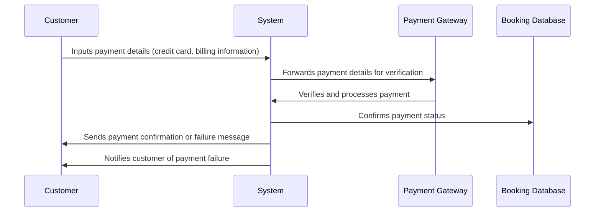
```mermaid
sequenceDiagram
    participant C as Customer
    participant S as System
    participant PG as Payment Gateway
    participant BD as Booking Database

    C->>S: Inputs payment details (credit card, billing information)
    S->>PG: Forwards payment details for verification
    PG->>S: Verifies and processes payment
    S->>BD: Confirms payment status
    S->>C: Sends payment confirmation or failure message
    S->>C: Notifies customer of payment failure

```

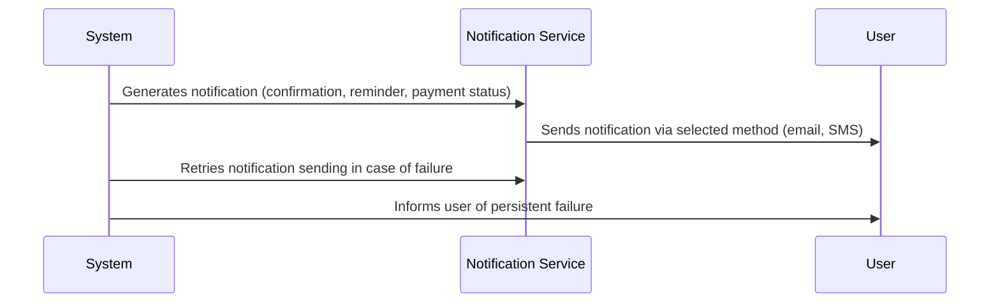
```mermaid
sequenceDiagram
    participant S as System
    participant NS as Notification Service
    participant U as User

    S->>NS: Generates notification (confirmation, reminder, payment status)
    NS->>U: Sends notification via selected method (email, SMS)
    S->>NS: Retries notification sending in case of failure
    S->>U: Informs user of persistent failure

```

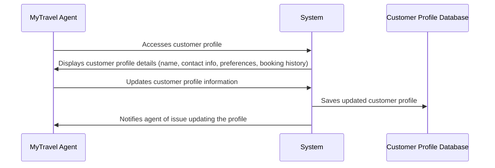
```mermaid
sequenceDiagram
    participant MA as MyTravel Agent
    participant S as System
    participant CPD as Customer Profile Database

    MA->>S: Accesses customer profile
    S->>MA: Displays customer profile details (name, contact info, preferences, booking history)
    MA->>S: Updates customer profile information
    S->>CPD: Saves updated customer profile
    S->>MA: Notifies agent of issue updating the profile

```

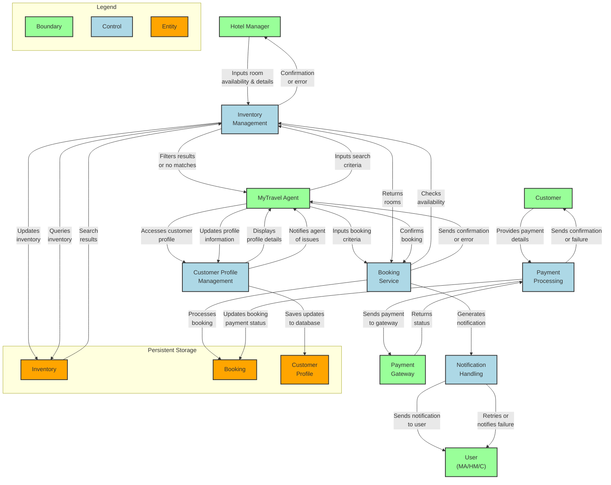
```mermaid
graph TD
    %% Boundary (Green)
    HM["Hotel Manager"]:::boundary
    MA["MyTravel Agent"]:::boundary
    C["Customer"]:::boundary
    U["User<br/>(MA/HM/C)"]:::boundary

    %% Control (Blue)
    IM["Inventory<br/>Management"]:::control
    BS["Booking<br/>Service"]:::control
    PP["Payment<br/>Processing"]:::control
    NH["Notification<br/>Handling"]:::control
    CPM["Customer Profile<br/>Management"]:::control

    %% Entity (Orange)
    subgraph Database [Persistent Storage]
        DB["Inventory"]:::entity
        BD["Booking"]:::entity
        CPD["Customer<br/>Profile"]:::entity
    end

    %% FR1: Manage Inventory
    HM --->|Inputs room<br/>availability & details| IM
    IM --->|Updates<br/>inventory| DB
    IM --->|Confirmation<br/>or error| HM

    %% FR2: Search Inventory
    MA --->|Inputs search<br/>criteria| IM
    IM --->|Queries<br/>inventory| DB
    DB --->|Search<br/>results| IM
    IM --->|Filters results<br/>or no matches| MA

    %% FR3: Book Room
    MA --->|Inputs booking<br/>criteria| BS
    BS --->|Checks<br/>availability| IM
    IM --->|Returns<br/>rooms| BS
    MA --->|Confirms<br/>booking| BS
    BS --->|Processes<br/>booking| BD
    BS --->|Sends confirmation<br/>or error| MA

    %% FR4: Process Payment
    C --->|Provides payment<br/>details| PP
    PP --->|Sends payment<br/>to gateway| PP_GATEWAY["Payment<br/>Gateway"]:::boundary
    PP_GATEWAY --->|Returns<br/>status| PP
    PP --->|Updates booking<br/>payment status| BD
    PP --->|Sends confirmation<br/>or failure| C

    %% FR5: Send Notification
    BS --->|Generates<br/>notification| NH
    NH --->|Sends notification<br/>to user| U
    NH --->|Retries or<br/>notifies failure| U

    %% FR6: Manage Customer Profile
    MA --->|Accesses customer<br/>profile| CPM
    CPM --->|Displays<br/>profile details| MA
    MA --->|Updates profile<br/>information| CPM
    CPM --->|Saves updates<br/>to database| CPD
    CPM --->|Notifies agent<br/>of issues| MA

    %% Legend
    subgraph Legend
        direction TB
        L1["Boundary"]:::boundary
        L2["Control"]:::control
        L3["Entity"]:::entity
    end

    %% Class Definitions
    classDef boundary fill:#99FF99,stroke:#333,stroke-width:2px;
    classDef control fill:#ADD8E6,stroke:#333,stroke-width:2px;
    classDef entity fill:#FFA500,stroke:#333,stroke-width:2px;

    %% Class Assignments
    class HM,MA,C,U,PP_GATEWAY,L1 boundary;
    class IM,BS,PP,NH,CPM,L2 control;
    class DB,BD,CPD,L3 entity;
```